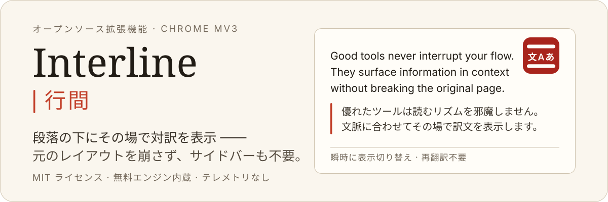
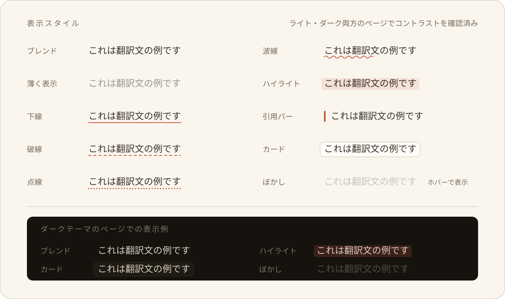

<p align="right">
  <a href="./README.md">English</a> · <a href="./README.zh-CN.md">简体中文</a> · <strong>日本語</strong> · <a href="./README.ko.md">한국어</a>
</p>

<p align="center">
  
</p>

<p align="center">
  <a href="./LICENSE"></a>
  
  
  
  
  
  
</p>

**Interline（行間）** は、Chrome 向けのオープンソース対訳リーディング拡張機能です。元の段落のすぐ下に訳文を直接挿入し、元のレイアウト・リンク・操作感を完全に維持したまま 2 つの言語を並読できます。ページを丸ごと置き換えたり、サイドバーに移動したりする必要はありません。

- **インストール直後から使える** —— API キー不要の無料翻訳エンジンを内蔵しており、初期設定なしですぐに翻訳できます。
- **自分の API キーを使用可能（BYOK）** —— より高品質な翻訳のために、OpenAI、Anthropic、Google Gemini、OpenRouter、および各種 OpenAI / Anthropic 互換エンドポイント（Ollama、Kimi、GLM、LiteLLM など）を自由に接続できます。
- **プライバシー最優先** —— アカウント登録不要、テレメトリやユーザー追跡は一切行わず、自社の中継サーバーもありません。リクエストはブラウザから直接指定のサービスへ送信されます。

---

## ページ全体の対訳リーディング

訳文は原文の**兄弟ノード**として DOM に挿入されるため、リンク、`<strong>`、インラインコード、リスト構造はそのまま保たれます。10 種類の表示スタイルから好みに合わせて選択できます：

<p align="center">
  
</p>

- **3 つの表示モード** —— 対訳（既定）、訳文のみ、原文のみ。切り替えは CSS のみで瞬時に行われ、再翻訳のトークン消費はありません。
- **段落ごとの対訳** —— 原文と訳文を段落単位で並べ、文章の上下分断を防ぎます。
- **フォントのカスタマイズ** —— 訳文に楷書系フォント（LXGW WenKai / 霞鹜文楷、Kaiti など）を適用するか、ホストページの書体に合わせるかを選択できます。

## 選択テキストの翻訳

ページ上のテキストを選択すると翻訳アイコンが浮き上がります。クリックすると訳文がカード内にストリーミング表示され、応答待ちの間はスケルトンアニメーションで待機時間を自然に埋めます。

LLM エンジン接続時は、慣用句・専門用語・固有名詞に関する**語句解説**をカード内で展開できます。

## 入力中のテキストをその場で翻訳

任意の入力欄で <kbd>Space</kbd> を 3 回押すと、入力中のテキストがその場で翻訳されます。文頭に `/en` や `en:` を付けることで、一時的に翻訳先言語を指定することも可能です。

ネイティブの `<input>` / `<textarea>`、`contenteditable` 領域、および各種リッチテキスト・コードエディタ（CKEditor、Slate、TipTap、Monaco、CodeMirror、wangEditor）に完全対応。書き込み時は読み戻し検証を行い、失敗時は安全にロールバックして下書きの破損を防ぎます。取り消し期間内であれば <kbd>⌘/Ctrl</kbd> + <kbd>Z</kbd> で元のテキストに復元できます。

## フローティングボタンと操作パネル

ドラッグ可能な軽量フローティングボタンがウィンドウの端に自動吸着し、閲覧を邪魔しません。ワンクリックでページ全体を翻訳できるほか、操作パネルを開いて翻訳先言語、表示モード、表示スタイル、サイトごとのルールを即座に変更できます。

---

## インストール

動作要件：Chrome 116 以降（または同バージョンの Chromium 系ブラウザ）。リポジトリには Firefox 向けビルド設定も含まれています。

### ソースからビルド

```bash
pnpm install
pnpm build          # ビルド成果物は .output/chrome-mv3/ に生成されます
```

1. Chrome で `chrome://extensions` を開きます。
2. 右上の「デベロッパーモード」を有効にします。
3. 「パッケージ化されていない拡張機能を読み込む」をクリックし、`.output/chrome-mv3/` ディレクトリを選択します。

**初回起動時：** ツールバーのアイコンをクリックして設定を開きます。内蔵の無料エンジンがすぐに利用可能です。より高品質な翻訳を行いたい場合は、「AI エンジン」で独自の API キーを設定してください。

## プライバシーとセキュリティ

- **直接通信のみ** —— 翻訳テキストは設定されたエンジンにのみ送信され、サードパーティへの送信やテレメトリ収集は一切行いません。本プロジェクトは中継サーバーを運営していません。
- **API キーのローカル保存** —— API キーはブラウザのローカルストレージ（`chrome.storage.local`）にのみ保存され、ログ出力されることもなく、リクエスト時の `Authorization` ヘッダー以外で外部に送信されることはありません。
- **HTTPS の強制** —— API キーの平文漏洩を防ぐため、カスタムエンドポイントには HTTPS を強制します（ローカルホスト `127.0.0.1` / `localhost` および `.local` ドメインを除く）。
- **最小限の権限** —— 要求する権限は `storage`、`contextMenus`、`alarms` のみです。`tabs` や `scripting` などの広範な権限は要求しません。

---

## カスタマイズと高度な機能

- **プロンプトスタイル** —— 学術的・平易・文学的などのプリセットを選択するか、カスタム指示を作成できます。実際のビルダーによるリアルタイムプレビューに対応し、特定ドメインへのスタイル紐付けも可能です。
- **用語集管理** —— 専門用語の訳語を固定し、一貫した翻訳を実現します。glob パターンによるドメイン制限、CSV / TSV / JSON のインポート・エクスポート、内蔵プリセットに対応しています。
- **サイトルール** —— ドメインごとに「常に翻訳」「手動翻訳」「翻訳しない」を設定可能（ワイルドカード対応）。
- **12 言語のインターフェース** —— `zh`、`zh-TW`、`en`、`ja`、`ko`、`fr`、`de`、`es`、`ru`、`pt`、`it`、`ar`（RTL 完全対応）。UI 言語はデフォルトで翻訳先言語に自動追従します。

## モデルごとのパラメータ自動調整

翻訳に必要な 3 つの設定項目（**温度（Temperature）**、**最大出力トークン**、**推論思考（Reasoning / Thinking）**）のみを提供し、モデル間のプロトコル差異を自動吸収します：

| モデル系列 | 自動適応処理 |
| --- | --- |
| OpenAI `o1` / `o3` / `o4` | カスタム温度を自動除外（API 拒否を回避）、推論オフ時はモデルが許容する最低エフォートにマッピング |
| Claude 3.7 / 4.x / 5.x | 予算付きの `thinking` パラメータを自動付与し、`max_tokens` を思考予算より大きく維持 |
| Claude 3.0 / 3.5 | `thinking` パラメータを自動除外（旧バージョンのエラー回避） |
| Gemini 2.x / 3.x | Gemini 公式仕様に合わせて `thinkingLevel` に自動マッピング |
| 推論ネイティブ（`r1`、`qwq`、`:thinking` など） | 明示的な無効化フラグ送信を回避（OpenRouter 等の HTTP 400 エラー防止） |

エンドポイントが特定のパラメータを拒否した場合、リクエストは異常フィールドを自動除外して 1 回再試行し、未知の新モデルでもエラーにならず正常にフォールバックします。

---

## 開発

```bash
pnpm dev                 # Chrome 開発環境（HMR 対応）
pnpm dev:firefox         # Firefox 開発環境

pnpm compile             # TypeScript 型チェック（tsc --noEmit）
pnpm lint                # ESLint コードチェック
pnpm test                # Vitest テストスイート（happy-dom + fake-browser）
pnpm i18n                # 文言コンパイル messages/*.json → src/paraglide

pnpm build && pnpm zip   # Chrome ウェブストア提出用の .output/*.zip を生成
```

`pnpm dev` は `test-pages/` も提供します（62.5% rem ルート、プレフィックスなし Tailwind v3、Shadow Root、仮想スクロールエディタなど、過酷な環境でのスタイル分離性を検証）。

### 品質ゲート

CI により 3 つの自動監査が実行されます：

```bash
pnpm audit:css       # すべてのルート級 CSS 変数が .aie-omt-surface-root 内にカプセル化されていることを検証
pnpm audit:ascii     # ビルド成果物が純 ASCII であることを保証（Chrome の非 ASCII 読み込み不具合回避 —— wxt#353）
pnpm audit:bundle    # コンテンツスクリプトの Gzip 予算制約: page-translate ≤ 100 KB、float-ui ≤ 260 KB
```

## アーキテクチャ

本プロジェクトは [aie-wxt-mantine-surface-template](https://github.com/AIEPhoenix/aie-wxt-mantine-surface-template) テンプレートをベースに開発されています。このテンプレートは、WXT、React 19、Mantine 9、および Shadow Root によるマルチサーフェス分離アーキテクチャの標準を定義しています。詳細な設計背景やスタイル分離パターンについては、テンプレートリポジトリをご参照ください。

```text
src/
├── entrypoints/           # WXT エントリポイント（薄いマウント層）
│   ├── background.ts      # 翻訳エンジン、ストリーミング、設定管理、メニュー、キャッシュ掃除
│   ├── options/           # フルスクリーンの設定ページ
│   ├── page-translate.content/   # ページ全体翻訳の状態管理
│   ├── float-ui.content/         # フローティングボタン + 選択カード（Shadow Surface 共有）
│   ├── editor-injector.content/  # メインワールド（MAIN world）エディタ通信ブリッジ
│   └── injector-port.content.ts  # 隔離ワールド ⇄ メインワールドのポートハンドシェイク
├── react-app/             # UI システム：アプリ、コンポーネント、Hooks、VisualManager
├── services/              # 翻訳エンジン、プロンプト構築、用語集、キャッシュ、設定、ストリーミング
├── dom/                   # DOM 走査、ノード挿入、ラッパー、入力欄のその場翻訳
├── surface/               # Shadow Surface 抽象（Document + Satellite）
└── data/models/           # 設定スキーマおよびコアデータ型
```

### 3 つのエンジニアリング原則

1. **ホストページの不可侵性** —— すべての拡張 UI は Shadow Root 内に完全に分離されます。挿入された訳文は加算的かつ完全に取り消し可能であり、翻訳解除後の DOM 構造は元のページとバイト単位で一致します。CSS 分離境界は `pnpm audit:css` で検証されます。
2. **エンジンとページの完全疎結合** —— コンテンツスクリプトは型付きメッセージポートを介してのみ Background Service Worker と通信します。API キーや AI SDK はすべて Service Worker に集約され、注入スクリプトのファイルサイズを最小限に保ちます。
3. **統一されたプロンプトパイプライン** —— 単発翻訳、ストリーミング翻訳、バッチ翻訳が同一の Preflight 検証、キャッシュキー生成、プロンプトビルダーを共有し、UI サーフェス間の挙動のズレを防ぎます。

`PROJECT_PREFIX`（`prefix.cjs`）がクラス名、カスタム要素、ストレージキー、CSS 変数の単一の名前空間ソースとして機能します。`check-prefix-sync` Vite プラグインがビルド時に同期状態を検証します。

## コントリビュート

Issue および Pull Request を歓迎します。PR を提出する前に、すべての品質チェックを実行してください：

```bash
pnpm compile && pnpm lint && pnpm test && pnpm build && pnpm audit:css && pnpm audit:ascii && pnpm audit:bundle
```

UI 文言は `messages/*.json` で一元管理されています。文言を変更した後は `pnpm i18n` を実行し、再生成された `src/paraglide/` ディレクトリも一緒にコミットしてください。

## ライセンス

[MIT](./LICENSE)

フォントは CSS フォントスタック経由で参照され、配布成果物には含まれません：LXGW WenKai（霞鹜文楷）、Hanken Grotesk、Spline Sans Mono、EB Garamond は SIL OFL 1.1 ライセンスに基づいており、未インストール時はローカルのシステムフォントに自動フォールバックします。
