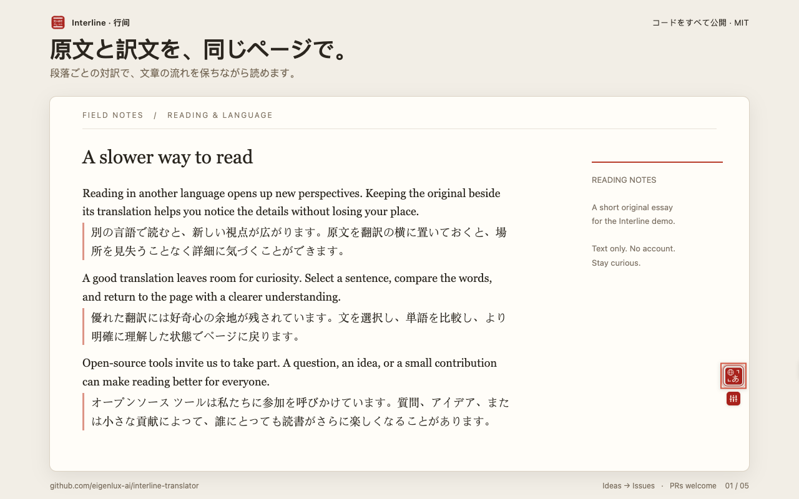

<p align="right">
  <a href="./README.md">English</a> · <a href="./README.zh-CN.md">简体中文</a> · <strong>日本語</strong> · <a href="./README.ko.md">한국어</a>
</p>

# Interline · 行间

**原文のそばで、世界を読む。**

Interline は、コードをすべて公開している Chrome 向けの対訳・翻訳拡張機能です。記事を段落ごとに対訳で読み、気になる文を選択して意味を確かめ、返信の下書きを入力欄でそのまま翻訳できます。

**[ソースコード](https://github.com/eigenlux-ai/interline-translator) · [機能をリクエスト](https://github.com/eigenlux-ai/interline-translator/issues/new?template=feature_request.yml) · [不具合を報告](https://github.com/eigenlux-ai/interline-translator/issues/new?template=bug_report.yml) · [開発に参加](./CONTRIBUTING.md)**

**[Chrome ウェブストアからインストール](https://chromewebstore.google.com/detail/mcefogikngeheopmdmaapfgpnnlgcoid)**

[MIT ライセンス](./LICENSE) · Chrome 116+ · キー不要の翻訳エンジン内蔵 · 自分の AI キーにも対応



## 読む、理解する、伝える

| やりたいこと | Interline でできること |
| --- | --- |
| 外国語のページを読む | フローティングコントロール、右クリックメニュー、**Alt+T** から翻訳。原文と訳文を同じページで確認できます。 |
| 一文の意味を知る | テキストを選択して翻訳アイコンをクリック。訳文の確認、コピー、読み上げができます。対応 AI エンジンでは語句の解説も利用できます。 |
| 別の言語で返信する | 下書きを入力し、**スペースを3回**押すとその場で翻訳。書き込み先の言語は読む言語と別に設定できます。 |
| 読みやすく整える | 対訳・訳文のみ・原文のみを切り替え、10種類の表示スタイルやライト・ダーク表示を選べます。 |
| 語調や用語をそろえる | AI エンジンで翻訳スタイル、プロンプト、用語集を設定し、サイトごとに適用できます。 |

実際の[選択翻訳カード](./assets/store/ja/screenshot-2-selection.png)、[エンジン設定](./assets/store/ja/screenshot-3-settings.png)、[入力欄の翻訳](./assets/store/ja/screenshot-4-input-translation.png)、[ダーク設定](./assets/store/ja/screenshot-5-dark-mode.png)もご覧ください。画像にはオリジナルのサンプル文章と実際の拡張機能を使用し、外枠に機能説明を添えています。

## 使い始める

**[Chrome ウェブストアからインストール](https://chromewebstore.google.com/detail/mcefogikngeheopmdmaapfgpnnlgcoid)**

ストアのページで **Chrome に追加**をクリックします。インストール後、記事を開き、フローティングコントロールか **Alt+T** で翻訳を開始できます。ツールバーの Interline アイコンから、読む言語と翻訳エンジンを設定してください。

### ソースからビルド

Git、Node.js 22+、pnpm 10.7.1（`package.json` の指定バージョン）を用意してください。

```sh
git clone https://github.com/eigenlux-ai/interline-translator.git
cd interline-translator
pnpm install --frozen-lockfile
pnpm build
```

1. Chrome で `chrome://extensions` を開き、**デベロッパーモード**を有効にします。
2. **パッケージ化されていない拡張機能を読み込む**を選び、リポジトリ内の `.output/chrome-mv3/` を指定します。
3. 記事を開き、フローティングコントロールか **Alt+T** で翻訳します。
4. ツールバーの Interline アイコンから設定を開き、読む言語を選びます。AI エンジンは必要に応じて追加できます。

内蔵の Google Translate エンジンに API キーは不要です。ただしオンラインサービスのため、利用可否はネットワークと提供元の状況に左右されます。

`chrome://` などブラウザが制限するページでは翻訳を挿入できません。サイトの構成やエディターによって動作は異なり、すべてのページとの互換性を保証するものではありません。Firefox 用の開発・ビルドコマンドも含まれていますが、掲載画像は Chromium 環境で撮影しています。

## 翻訳エンジンを選ぶ

内蔵の無料エンジンから始められます。自分の API キーで **OpenAI、Anthropic、Google Gemini、OpenRouter** や OpenAI / Anthropic 互換サービスにも接続できます。適切に設定すれば、Ollama などのローカルサービスも利用できます。

Interline のコードは MIT ライセンスで無料公開しています。外部 AI サービスには API 利用料金や独自の利用枠・提供条件がある場合があります。AI エンジンではプロンプトスタイル、用語集の指示、文脈に応じた解説を利用でき、翻訳品質はモデル・文章・設定によって変わります。

入力欄の下書きに `/en` または `en:` を付けると、その回だけ英語に翻訳できます。翻訳後に一時表示される操作ボタンで原文に戻せます。通常の入力欄、テキストエリア、編集可能な領域と複数のリッチテキスト・コードエディターに対応していますが、動作はサイト側の実装によって異なります。

## 自分に合った読み方に

- **表示：** 3つの表示モード、10種類の訳文スタイル、訳文フォントを選べます。翻訳済みページの表示切り替えで再翻訳は行いません。
- **サイトルール：** 自動翻訳するサイトや翻訳しないサイトを指定できます。ワイルドカードにも対応しています。
- **表示言語：** アラビア語の RTL 表示を含む12言語に対応。既定では読む言語に合わせますが、個別にも設定できます。
- **バックアップ：** 設定の書き出し・読み込みに対応。**書き出した JSON には API キーが含まれます。** 非公開で保管してください。

## データの取り扱い

Interline のアカウント登録は不要です。行動分析やテレメトリーはなく、翻訳中継サーバーも運営していません。翻訳リクエストはブラウザから選択した提供元へ直接送信します。内蔵エンジンの場合、送信先は Google です。

送信内容は翻訳対象の文章と、AI 機能に必要なページタイトル、周辺の文章、該当する用語集の項目などです。**ページ全体のコンテキスト**を有効にすると、まだスクロールしていない部分を含むページ先頭の最大 8,000 文字も送信します。サイトの自動翻訳ルールにより、ページごとのクリックなしに翻訳を開始する場合があります。

設定と API キーはブラウザに保存し、必要な認証情報を選択したサービスへ送信します。訳文はローカルにキャッシュします。提供元にはそれぞれのデータポリシーがあります。権限、キャッシュの保存期間、バックアップについては[プライバシー説明（英語・中国語）](./PRIVACY.md)をご覧ください。

## すべてのコードを公開。改善への参加を歓迎します。

全ソースコードを [MIT ライセンス](./LICENSE)で公開しています。実装の確認、自分でのビルド、改変、改善の提案が可能です。

- **欲しい機能がある場合：** [Issue を作成](https://github.com/eigenlux-ai/interline-translator/issues/new?template=feature_request.yml)し、利用場面や解決したい問題を教えてください。
- **不具合を見つけた場合：** 再現手順とブラウザのバージョンを添えて[報告](https://github.com/eigenlux-ai/interline-translator/issues/new?template=bug_report.yml)してください。
- **開発に参加したい場合：** コード、修正、翻訳、文書、再現用の例を歓迎します。**PRs welcome!** [貢献ガイド（英語）](./CONTRIBUTING.md)と [Pull Requests](https://github.com/eigenlux-ai/interline-translator/pulls)をご覧ください。

公開の報告に API キー、非公開ページの内容、設定バックアップを添付しないでください。

## 開発

```sh
pnpm dev          # Chrome 開発環境と HMR
pnpm compile      # TypeScript チェック
pnpm lint         # ESLint
pnpm test         # テスト
pnpm build        # Chrome 本番ビルド
pnpm zip          # 拡張機能のパッケージ化
```

構成、テストページ、多言語対応、ビルド検査は[貢献ガイド（英語）](./CONTRIBUTING.md)へ。ストア紹介文、実際のスクリーンショット、再生成手順は[ストア素材ガイド（中国語）](./assets/store/README.md)にまとめています。

WXT、React、Mantine、TypeScript を使用し、[aie-wxt-mantine-surface-template](https://github.com/AIEPhoenix/aie-wxt-mantine-surface-template) を基盤としています。
