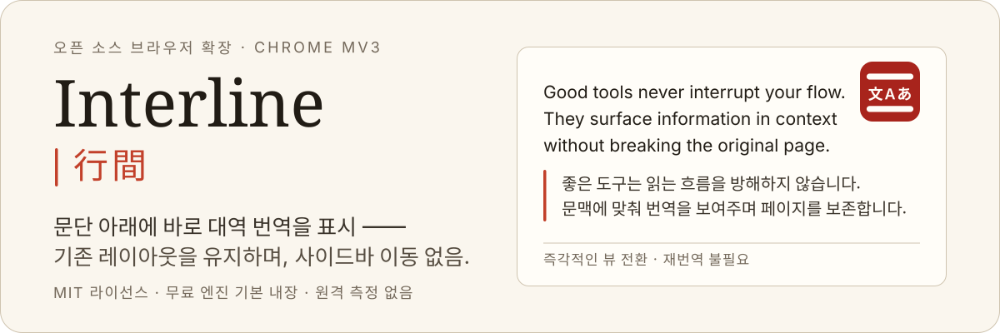
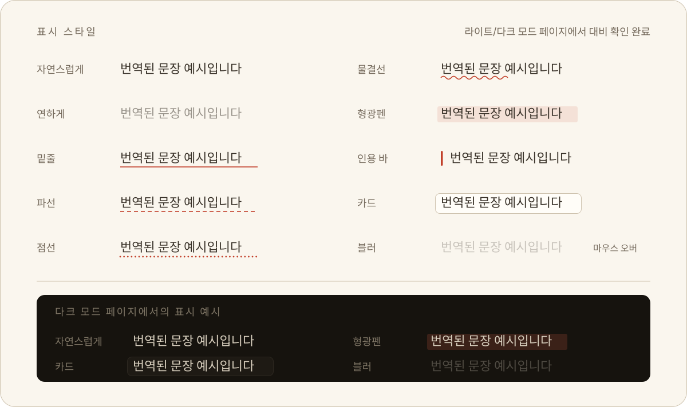

<p align="right">
  <a href="./README.md">English</a> · <a href="./README.zh-CN.md">简体中文</a> · <a href="./README.ja.md">日本語</a> · <strong>한국어</strong>
</p>

<p align="center">
  
</p>

<p align="center">
  <a href="./LICENSE"></a>
  
  
  
  
  
  
</p>

**Interline(행간)** 은 Chrome 전용 오픈 소스 대역(Bilingual) 읽기 확장 프로그램입니다. 번역문이 원문 문단 바로 아래에 삽입되어, 웹페이지의 원래 레이아웃, 링크, 서식 및 상호작용을 온전히 유지한 채 두 언어를 나란히 대조하며 읽을 수 있습니다. 페이지 전체를 덮어쓰거나 사이드바로 이동할 필요가 없습니다.

- **설치 즉시 사용 가능** —— API 키가 필요 없는 무료 번역 엔진이 기본 내장되어 있어, 설치 직후 별도 설정 없이 바로 번역할 수 있습니다.
- **자체 API 키 지원(BYOK)** —— 더 높은 번역 품질을 위해 OpenAI, Anthropic, Google Gemini, OpenRouter 및 다양한 OpenAI / Anthropic 호환 엔드포인트(Ollama, Kimi, GLM, LiteLLM 등)를 자유롭게 연결할 수 있습니다.
- **개인정보 최우선 보호** —— 회원가입 불필요, 원격 측정(Telemetry) 및 사용자 추적 코드 배제, 자체 중계 서버 없음. 모든 요청은 브라우저에서 지정된 서비스로 직접 전송됩니다.

---

## 페이지 전체 대역 읽기

번역문은 원문의 **형제 노드(Sibling Node)** 로 DOM 에 삽입되므로 링크, `<strong>`, 인라인 코드, 목록 구조가 그대로 유지됩니다. 10가지 표시 스타일을 제공하여 취향에 맞게 선택할 수 있습니다:

<p align="center">
  
</p>

- **세 가지 보기 모드** —— 대역(기본), 번역문만 보기, 원문만 보기. 뷰 전환은 순수 CSS 로 즉시 처리되며, 재번역에 따른 토큰 소모가 없습니다.
- **문단 단위 대조** —— 원문과 번역문을 문단별로 나란히 배치하여 위아래로 글이 분리되는 현상을 방지합니다.
- **서체 맞춤 설정** —— 번역문에 해서체/명조 계열 폰트(LXGW WenKai / 霞鹜文楷, Kaiti, 바탕체 등)를 적용하거나 호스트 웹페이지 서체를 그대로 따르도록 설정할 수 있습니다.

## 선택 영역 번역

페이지에서 텍스트를 드래그하면 번역 아이콘이 나타납니다. 아이콘을 클릭하면 번역문이 팝업 카드 내에 스트리밍 방식으로 표시되며, 응답 대기 중에는 스켈레톤 애니메이션으로 공백 대기 시간을 채웁니다.

LLM 엔진 연결 시 카드 내에서 **단어 설명**을 펼쳐 관용구, 기술 용어, 고유명사에 대한 문맥 설명을 확인할 수 있습니다.

## 입력 중인 텍스트 즉석 번역

아무 입력창에서나 <kbd>Space</kbd> 키를 연속으로 세 번 누르면 입력 중인 초안이 그 자리에서 번역됩니다. 문장 맨 앞에 `/en` 또는 `en:` 을 붙여 특정 1회 번역의 대상 언어를 즉시 지정할 수도 있습니다.

네이티브 `<input>` / `<textarea>`, `contenteditable` 영역, 및 다양한 리치 텍스트/코드 에디터(CKEditor, Slate, TipTap, Monaco, CodeMirror, wangEditor)를 완벽 지원합니다. 모든 쓰기 작업은 되읽기 검증을 수행하여 실패 시 안전하게 롤백되므로 초안이 손상되지 않으며, 실행 취소 창 내에서 <kbd>⌘/Ctrl</kbd> + <kbd>Z</kbd> 로 원문을 손쉽게 복원할 수 있습니다.

## 플로팅 버튼 및 퀵 컨트롤 패널

자유롭게 드래그할 수 있는 경량 플로팅 버튼이 화면 가장자리에 자동으로 달라붙어 읽기를 방해하지 않습니다. 클릭 한 번으로 페이지 전체를 번역할 수 있으며, 컨트롤 패널을 열어 대상 언어, 보기 모드, 표시 스타일, 사이트별 규칙을 즉시 변경할 수 있습니다.

---

## 설치 방법

시스템 요구사항: Chrome 116 이상(또는 동일 버전의 Chromium 기반 브라우저). 코드베이스에 Firefox 빌드 타깃도 포함되어 있습니다.

### 소스에서 빌드

```bash
pnpm install
pnpm build          # 빌드 산출물은 .output/chrome-mv3/ 에 생성됩니다
```

1. Chrome 에서 `chrome://extensions` 로 이동합니다.
2. 우측 상단의 **개발자 모드**를 활성화합니다.
3. **압축해제된 확장 프로그램을 로드합니다**를 클릭하고 `.output/chrome-mv3/` 폴더를 선택합니다.

**처음 실행 시:** 브라우저 툴바 아이콘을 클릭하여 설정을 엽니다. 내장된 무료 엔진이 바로 준비되어 있으며, 더 높은 번역 품질을 원할 경우 **AI 엔진** 메뉴에서 자체 API 키를 설정하세요.

## 개인정보 보호 및 보안

- **직접 통신만 수행** —— 번역 텍스트는 사용자가 설정한 엔진으로만 전송되며, 제3자 데이터 수집이나 원격 측정을 일절 수행하지 않습니다. 본 프로젝트는 어떠한 중앙 서버도 운영하지 않습니다.
- **로컬 자격 증명 저장** —— API 키는 브라우저 로컬 스토리지(`chrome.storage.local`)에만 저장되며, 실행 로그에 기록되지 않고 요청 시 `Authorization` 헤더 외에는 외부로 전송되지 않습니다.
- **HTTPS 강제** —— API 키가 평문 네트워크로 노출되는 것을 방지하기 위해 사용자 지정 엔드포인트에는 HTTPS 를 강제합니다(로컬호스트 `127.0.0.1` / `localhost` 및 `.local` 로컬 도메인 제외).
- **최소 권한 원칙** —— `storage`, `contextMenus`, `alarms` 권한만 요청하며, `tabs`, `scripting` 과 같은 광범위한 권한은 요청하지 않습니다.

---

## 맞춤 설정 및 고급 기능

- **프롬프트 스타일** —— 학술적, 대화체, 문학적 등의 프리셋 톤을 선택하거나 사용자 지정 지시문을 작성할 수 있습니다. 실제 빌더를 통한 실시간 미리보기를 제공하며, 특정 도메인에 스타일을 바인딩할 수 있습니다.
- **용어집 관리(Glossary)** —— 전문 용어의 번역어를 고정하여 일관된 번역 품질을 유지합니다. glob 패턴 도메인 지정, CSV / TSV / JSON 가져오기 및 내보내기, 내장 프리셋을 지원합니다.
- **사이트별 규칙** —— 도메인별로 '항상 번역', '수동 번역', '번역 안 함'을 설정할 수 있습니다(와일드카드 지원).
- **12개 인터페이스 언어** —— `zh`, `zh-TW`, `en`, `ja`, `ko`, `fr`, `de`, `es`, `ru`, `pt`, `it`, `ar`(RTL 완벽 지원). UI 언어는 기본적으로 번역 대상 언어에 맞춰 자동으로 전환됩니다.

## 모델별 파라미터 자동 최적화

번역에 필요한 3가지 핵심 설정(**온도(Temperature)**, **최대 출력 토큰**, **추론 사고(Reasoning / Thinking)**)만 제공하며, 모델 패밀리 간 프로토콜 차이를 자동으로 해결합니다:

| 모델 패밀리 | 자동 호환 처리 내용 |
| --- | --- |
| OpenAI `o1` / `o3` / `o4` | 사용자 지정 온도 파라미터 자동 제외(엔드포인트 에러 방지), 추론 비활성화 시 최저 허용 레벨로 매핑 |
| Claude 3.7 / 4.x / 5.x | 예산이 지정된 `thinking` 파라미터를 자동 전달하며, `max_tokens` 가 사고 예산보다 높게 유지되도록 보장 |
| Claude 3.0 / 3.5 | `thinking` 파라미터를 자동 제외하여 구버전 모델의 호출 오류 방지 |
| Gemini 2.x / 3.x | Gemini 공식 사양에 맞춰 `thinkingLevel` 파라미터로 자동 매핑 |
| 추론 네이티브 모델(`r1`, `qwq`, `:thinking` 등) | 명시적 비활성화 플래그 전송을 방지하여 OpenRouter 등의 HTTP 400 오류 방지 |

엔드포인트가 특정 파라미터를 거부하더라도, 요청이 이상 필드를 자동 제외하고 1회 즉시 재시도하여 미지의 새 모델에서도 오류 없이 정상 동작합니다.

---

## 로컬 개발

```bash
pnpm dev                 # Chrome 개발 환경(HMR 지원)
pnpm dev:firefox         # Firefox 개발 환경

pnpm compile             # TypeScript 타입 검사(tsc --noEmit)
pnpm lint                # ESLint 코드 검사
pnpm test                # Vitest 테스트 스위트(happy-dom + fake-browser)
pnpm i18n                # 문구 컴파일 messages/*.json → src/paraglide

pnpm build && pnpm zip   # Chrome 웹 스토어 배포용 .output/*.zip 빌드
```

`pnpm dev` 실행 시 `test-pages/` 테스트 페이지도 함께 제공됩니다(62.5% rem 루트 폰트 크기, 프리픽스 없는 Tailwind v3, Shadow Root, 가상 스크롤 에디터 등 가혹한 환경에서의 격리성 검증).

### 품질 게이트

CI 파이프라인에서 세 가지 자동화 감사를 수행합니다:

```bash
pnpm audit:css       # 모든 루트 레벨 CSS 변수가 .aie-omt-surface-root 내에 캡슐화되어 있는지 검증
pnpm audit:ascii     # 빌드 산출물이 순수 ASCII 문자열인지 확인 (Chrome 의 비 ASCII 청크 로딩 버그 방지 —— wxt#353)
pnpm audit:bundle    # 콘텐츠 스크립트 Gzip 용량 예산 검증: page-translate ≤ 100 KB, float-ui ≤ 260 KB
```

## 핵심 아키텍처 설계

본 프로젝트는 [aie-wxt-mantine-surface-template](https://github.com/AIEPhoenix/aie-wxt-mantine-surface-template) 템플릿을 기반으로 개발되었습니다. 이 템플릿은 WXT, React 19, Mantine 9 및 Shadow Root 기반의 멀티 서피스 격리 아키텍처 표준을 정의합니다. 더 자세한 설계 배경과 스타일 격리 패턴은 해당 템플릿 저장소를 참고하세요.

```text
src/
├── entrypoints/           # WXT 엔트리 포인트(경량 마운트 계층)
│   ├── background.ts      # 번역 엔진, 스트리밍 서버, 설정 게이트웨이, 메뉴, 캐시 정리
│   ├── options/           # 전체 화면 설정 페이지
│   ├── page-translate.content/   # 페이지 전체 번역 상태 관리자
│   ├── float-ui.content/         # 플로팅 버튼 + 텍스트 선택 카드(Shadow Surface 공유)
│   ├── editor-injector.content/  # 메인 월드(MAIN world) 에디터 통신 브리지
│   └── injector-port.content.ts  # 격리 월드 ⇄ 메인 월드 포트 핸드셰이크
├── react-app/             # UI 시스템: 앱, 컴포넌트, Hooks, VisualManager
├── services/              # 번역 엔진, 프롬프트 빌더, 용어집, 캐시, 설정, 스트리밍
├── dom/                   # DOM 순회, 노드 삽입, 래퍼, 입력창 즉석 번역
├── surface/               # Shadow Surface 추상화(Document + Satellite)
└── data/models/           # 설정 스키마 및 핵심 데이터 타입
```

### 세 가지 엔지니어링 원칙

1. **호스트 페이지의 불가침성** —— 모든 확장 UI 요소는 Shadow Root 내부에 완벽히 격리됩니다. 삽입된 번역문은 가산적이며 완전히 롤백 가능하여, 번역 해제 시 DOM 구조는 원래 웹페이지와 바이트 단위로 일치합니다. CSS 격리 경계는 `pnpm audit:css` 로 검증됩니다.
2. **엔진과 웹페이지의 완전한 분리** —— 콘텐츠 스크립트는 타입이 지정된 메시지 포트를 통해서만 Background Service Worker 와 통신합니다. API 키와 AI SDK 종속성은 모두 Service Worker 에만 존재하여 주입 스크립트 용량을 엄격한 예산 내로 유지합니다.
3. **단일 프롬프트 파이프라인** —— 단발 번역, 스트리밍 번역, 배치 번역이 동일한 Preflight 검증, 캐시 키 생성, 프롬프트 빌더 로직을 공유하여 UI 간 동작 불일치를 방지합니다.

`PROJECT_PREFIX`(`prefix.cjs`)가 클래스명, 커스텀 엘리먼트, 스토리지 키, CSS 변수의 단일 네임스페이스 출처 역할을 합니다. `check-prefix-sync` Vite 플러그인이 빌드 시 동기화 여부를 검증합니다.

## 기여하기

Issue 및 Pull Request 생성을 환영합니다. PR 을 제출하기 전에 모든 품질 검사를 통과하는지 확인하세요:

```bash
pnpm compile && pnpm lint && pnpm test && pnpm build && pnpm audit:css && pnpm audit:ascii && pnpm audit:bundle
```

UI 문구는 `messages/*.json` 에서 중앙 관리됩니다. 문구를 수정한 후에는 `pnpm i18n` 을 실행하고 재생성된 `src/paraglide/` 디렉터리도 함께 커밋해 주세요.

## 소프트웨어 라이선스

[MIT](./LICENSE)

폰트는 표준 CSS 폰트 스택을 통해 선언 참조되며 배포 산출물에 번들링되지 않습니다. LXGW WenKai(霞鹜文楷), Hanken Grotesk, Spline Sans Mono, EB Garamond 는 모두 SIL OFL 1.1 라이선스를 따르며, 시스템에 설치되어 있지 않은 경우 로컬 시스템 폰트로 자동 대체됩니다.
