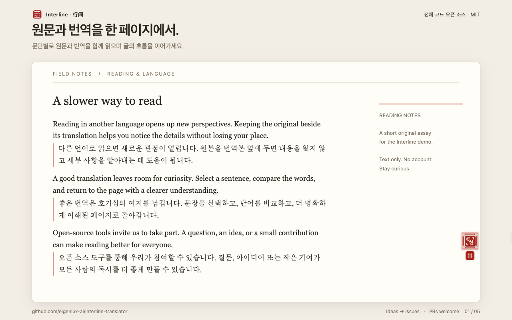

<p align="right">
  <a href="./README.md">English</a> · <a href="./README.zh-CN.md">简体中文</a> · <a href="./README.ja.md">日本語</a> · <strong>한국어</strong>
</p>

# Interline · 行间

**원문 곁에서, 더 넓은 세상을.**

Interline은 전체 코드를 공개한 Chrome용 이중 언어 읽기·번역 확장 프로그램입니다. 기사를 문단별로 대조해서 읽고, 궁금한 문장을 선택해 뜻을 확인하고, 답글 초안을 입력한 자리에서 번역하세요.

**[전체 소스 코드](https://github.com/eigenlux-ai/interline-translator) · [기능 제안](https://github.com/eigenlux-ai/interline-translator/issues/new?template=feature_request.yml) · [버그 신고](https://github.com/eigenlux-ai/interline-translator/issues/new?template=bug_report.yml) · [기여하기](./CONTRIBUTING.md)**

**[Chrome 웹 스토어에서 설치](https://chromewebstore.google.com/detail/mcefogikngeheopmdmaapfgpnnlgcoid)**

[MIT 라이선스](./LICENSE) · Chrome 116+ · 키 없는 기본 번역 엔진 · 내 AI 키 연결



## 읽고, 이해하고, 답하기

| 하고 싶은 일 | Interline이 돕는 방법 |
| --- | --- |
| 외국어 페이지 읽기 | 플로팅 컨트롤, 마우스 오른쪽 버튼 메뉴 또는 **Alt+T**로 번역을 시작합니다. 원문과 번역을 같은 페이지에서 읽으세요. |
| 문장의 뜻 이해하기 | 텍스트를 선택하고 번역 아이콘을 누르면 결과를 읽고, 복사하고, 들어볼 수 있습니다. 지원되는 AI 엔진에서는 어휘 설명도 제공합니다. |
| 다른 언어로 답글 쓰기 | 초안을 작성한 뒤 **스페이스를 세 번** 눌러 바로 번역합니다. 쓰기 대상 언어는 읽기 언어와 따로 설정할 수 있습니다. |
| 편하게 읽기 | 이중 언어·번역만·원문만 보기를 전환하고, 10가지 표시 스타일과 밝은 화면·다크 모드를 선택하세요. |
| 어조와 용어 통일하기 | AI 엔진의 번역 스타일, 프롬프트, 용어집을 설정하고 사이트별로 적용하세요. |

실제 [선택 번역 카드](./assets/store/ko/screenshot-2-selection.png), [엔진 설정](./assets/store/ko/screenshot-3-settings.png), [입력창 번역](./assets/store/ko/screenshot-4-input-translation.png), [다크 설정](./assets/store/ko/screenshot-5-dark-mode.png)도 확인하세요. 직접 작성한 예문과 실제 확장 프로그램으로 촬영했으며, 화면 바깥의 문구는 기능 설명입니다.

## 시작하기

**[Chrome 웹 스토어에서 설치](https://chromewebstore.google.com/detail/mcefogikngeheopmdmaapfgpnnlgcoid)**

스토어 페이지에서 **Chrome에 추가**를 클릭하세요. 설치 후 기사를 열고 플로팅 번역 컨트롤이나 **Alt+T**로 번역을 시작할 수 있습니다. 도구 모음의 Interline 아이콘에서 읽기 대상 언어와 번역 엔진을 설정하세요.

### 소스에서 빌드

Git, Node.js 22+, pnpm 10.7.1(`package.json`에 지정된 버전)이 필요합니다.

```sh
git clone https://github.com/eigenlux-ai/interline-translator.git
cd interline-translator
pnpm install --frozen-lockfile
pnpm build
```

1. Chrome에서 `chrome://extensions`를 열고 **개발자 모드**를 켭니다.
2. **압축해제된 확장 프로그램을 로드합니다**를 선택하고 저장소의 `.output/chrome-mv3/` 폴더를 지정합니다.
3. 기사를 열고 플로팅 번역 컨트롤이나 **Alt+T**로 번역을 시작합니다.
4. 도구 모음의 Interline 아이콘을 눌러 설정을 열고 읽기 대상 언어를 선택하세요. AI 엔진은 필요할 때 추가하면 됩니다.

기본 Google Translate 엔진은 API 키가 필요하지 않습니다. 다만 온라인 서비스이므로 네트워크와 제공업체 상황에 따라 이용 가능 여부가 달라집니다.

`chrome://` 등 브라우저가 제한하는 페이지에는 번역을 삽입할 수 없습니다. 사이트 구성과 편집기 구현이 다양하므로 모든 페이지와의 호환성을 보장하지는 않습니다. Firefox 개발·빌드 명령도 포함되어 있지만, 여기에 실린 화면은 Chromium 환경에서 촬영했습니다.

## 번역 엔진 선택하기

기본 무료 엔진으로 시작하거나, 내 API 키로 **OpenAI, Anthropic, Google Gemini, OpenRouter** 및 OpenAI / Anthropic 호환 서비스를 연결하세요. 적절히 설정하면 Ollama 같은 로컬 서비스도 사용할 수 있습니다.

Interline 코드는 MIT 라이선스로 무료 공개됩니다. 외부 AI 서비스에는 API 요금, 할당량, 이용 조건이 있을 수 있습니다. AI 엔진에서는 프롬프트 스타일, 용어집 지침, 문맥에 맞는 설명을 사용할 수 있으며, 번역 품질은 모델·텍스트·설정에 따라 달라집니다.

입력창 초안 앞에 `/en` 또는 `en:`을 붙이면 이번 번역만 영어로 지정할 수 있습니다. 번역 후 잠시 나타나는 실행 취소 버튼으로 원문을 복원할 수 있습니다. 기본 입력창, 텍스트 영역, 편집 가능한 콘텐츠와 여러 리치 텍스트·코드 편집기를 지원하며, 실제 동작은 사이트의 편집기에 따라 다릅니다.

## 나에게 맞는 읽기 방식

- **표시:** 3가지 보기 모드, 10가지 번역 스타일, 번역 글꼴을 선택하세요. 이미 번역된 페이지의 보기 전환은 새 번역 요청을 보내지 않습니다.
- **사이트 규칙:** 자동 번역할 사이트와 번역하지 않을 사이트를 지정합니다. 와일드카드도 지원합니다.
- **인터페이스 언어:** 아랍어 RTL 화면을 포함한 12가지 언어를 제공합니다. 기본적으로 읽기 대상 언어를 따르며 별도 설정도 가능합니다.
- **백업:** 설정을 내보내고 가져올 수 있습니다. **내보낸 JSON에는 API 키가 포함됩니다.** 비공개로 보관하세요.

## 데이터 처리 방식

Interline 계정 등록은 필요하지 않습니다. 행동 분석이나 텔레메트리가 없으며 번역 중계 서버도 운영하지 않습니다. 번역 요청은 브라우저에서 선택한 제공업체로 직접 전송됩니다. 기본 엔진의 전송 대상은 Google입니다.

요청에는 번역할 텍스트가 포함되며, AI 기능은 필요한 경우 페이지 제목, 주변 문장, 일치하는 용어집 항목 등을 사용합니다. **전체 페이지 문맥**을 켜면 아직 스크롤하지 않은 부분을 포함한 페이지 앞부분 최대 8,000자도 전송됩니다. 사이트 자동 번역 규칙에 따라 페이지마다 클릭하지 않아도 번역이 시작될 수 있습니다.

설정과 API 키는 브라우저에 저장되며, 서비스 호출 시 필요한 인증 정보가 선택한 서비스로 전송됩니다. 번역 결과는 로컬에 캐시됩니다. 제공업체마다 별도의 데이터 정책이 있습니다. 권한, 캐시 보관 기간, 백업에 관한 자세한 내용은 [개인정보 설명(영어·중국어)](./PRIVACY.md)을 확인하세요.

## 전체 코드 공개. 함께 개선해 주세요.

모든 소스 코드를 [MIT 라이선스](./LICENSE)로 공개합니다. 구현을 살펴보고, 직접 빌드하고, 수정하거나 개선 사항을 기여할 수 있습니다.

- **새로운 기능이 필요한가요?** [Issue를 열어](https://github.com/eigenlux-ai/interline-translator/issues/new?template=feature_request.yml) 사용 상황과 해결하고 싶은 문제를 알려 주세요.
- **버그를 발견했나요?** 재현 단계와 브라우저 버전을 포함해 [신고](https://github.com/eigenlux-ai/interline-translator/issues/new?template=bug_report.yml)해 주세요.
- **참여하고 싶나요?** 코드, 수정, 번역, 문서, 재현 예시 모두 환영합니다. **PRs welcome!** [기여 안내(영어)](./CONTRIBUTING.md)와 [Pull Requests](https://github.com/eigenlux-ai/interline-translator/pulls)를 확인하세요.

공개 보고에 API 키, 비공개 페이지 내용, 설정 백업 파일을 첨부하지 마세요.

## 개발

```sh
pnpm dev          # Chrome 개발 환경과 HMR
pnpm compile      # TypeScript 검사
pnpm lint         # ESLint
pnpm test         # 테스트
pnpm build        # Chrome 프로덕션 빌드
pnpm zip          # 확장 프로그램 패키징
```

구조, 테스트 페이지, 다국어 관리, 빌드 검사는 [기여 안내(영어)](./CONTRIBUTING.md)에 정리되어 있습니다. 스토어 소개 문구, 실제 화면, 재생성 방법은 [스토어 자료 안내(중국어)](./assets/store/README.md)를 참고하세요.

WXT, React, Mantine, TypeScript를 사용하며 [aie-wxt-mantine-surface-template](https://github.com/AIEPhoenix/aie-wxt-mantine-surface-template)을 기반으로 합니다.
