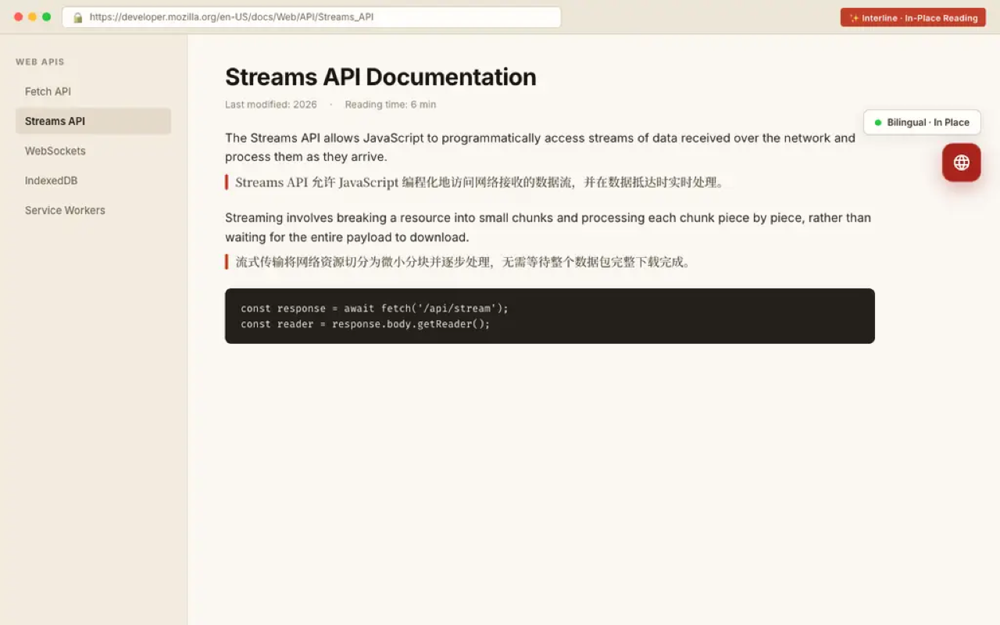

<p align="right">
  <strong>English</strong> · <a href="./README.zh-CN.md">简体中文</a> · <a href="./README.ja.md">日本語</a> · <a href="./README.ko.md">한국어</a>
</p>

# Interline · 行间

**Read beyond language. Keep the original in sight.**

Interline is a fully open-source Chrome extension for bilingual reading and translation. Read an article with translations beside each paragraph, look up a selected sentence, or translate a draft where you are already writing.

**[Source code](https://github.com/eigenlux-ai/interline-translator) · [Request a feature](https://github.com/eigenlux-ai/interline-translator/issues/new?template=feature_request.yml) · [Report a bug](https://github.com/eigenlux-ai/interline-translator/issues/new?template=bug_report.yml) · [Contribute](./CONTRIBUTING.md)**

**[Install from the Chrome Web Store](https://chromewebstore.google.com/detail/mcefogikngeheopmdmaapfgpnnlgcoid)**

[MIT licensed](./LICENSE) · Chrome 116+ · Built-in key-free translation · Bring your own AI key



## Read, understand, reply

| What you want to do | How Interline helps |
| --- | --- |
| Read a page in another language | Translate from the floating control, right-click menu or **Alt+T**. Keep the original and translation together. |
| Understand a sentence | Select text and click the translation icon to read, copy or listen to the result. Supported AI engines can also provide vocabulary notes. |
| Write in another language | Type a draft, then press **Space three times** to translate it in place. The writing language is separate from your reading language. |
| Make reading comfortable | Switch between bilingual, translation-only and original-only views; choose from 10 display styles and light or dark appearance. |
| Keep wording consistent | With an AI engine, customize translation styles, prompts and glossaries. Apply preferences to specific sites. |

See the actual [selection card](./assets/store/global/screenshot-2-selection.png), [engine settings](./assets/store/global/screenshot-3-settings.png), [input translation](./assets/store/global/screenshot-4-input-translation.png) and [dark settings](./assets/store/global/screenshot-5-dark-mode.png). Screenshots use original sample content and the real extension; captions around the captures describe the features.

## Get started

**[Install from the Chrome Web Store](https://chromewebstore.google.com/detail/mcefogikngeheopmdmaapfgpnnlgcoid)**

Open the store page and click **Add to Chrome**. After installing, open an article and use the floating translation control or **Alt+T**. Click Interline’s toolbar icon to choose your reading language and translation engine.

### Build from source

You need Git, Node.js 22+ and pnpm 10.7.1 (the version pinned in `package.json`).

```sh
git clone https://github.com/eigenlux-ai/interline-translator.git
cd interline-translator
pnpm install --frozen-lockfile
pnpm build
```

1. Open `chrome://extensions` in Chrome and enable **Developer mode**.
2. Choose **Load unpacked** and select `.output/chrome-mv3/` inside the repository.
3. Open an article, then use the floating translation control or **Alt+T**.
4. Click Interline's toolbar icon to open settings. Choose your reading language; add an AI engine only if you want one.

The built-in Google Translate engine does not need an API key. It uses an online service, so availability depends on your network and the provider.

Chrome's restricted pages, including `chrome://` pages, do not allow in-page translation. Site layouts and editor implementations vary; compatibility with every page is not guaranteed. Firefox build commands are included for development, but the screenshots here were captured in Chromium.

## Choose your translation engine

Start with the built-in free engine, or connect your own API key for **OpenAI, Anthropic, Google Gemini, OpenRouter**, or a service compatible with the OpenAI or Anthropic protocol. Compatible endpoints can include local services such as Ollama when configured appropriately.

Interline's code is free under MIT. Third-party AI providers may charge for API usage and set their own quotas and availability. An AI engine enables prompt styles, glossary instructions and contextual notes; translation quality depends on the model, text and settings.

For input translation, prefix a draft with `/en` or `en:` to choose English for that one translation. A temporary undo control lets you restore the original. Native inputs, textareas, editable content and several rich-text/code editor integrations are supported; behavior depends on the host editor.

## Your settings, your reading habits

- **Display:** three views, 10 translation styles, and a choice of translation font. Switching views of an already translated page does not make a new translation request.
- **Site rules:** choose sites to translate automatically or leave untranslated, with wildcard matching.
- **Language:** 12 interface languages, including Arabic with RTL layout. By default the interface follows your reading target; you can choose it separately.
- **Backup:** export and import your settings. **The exported JSON includes API keys**; keep it private.

## How your data is handled

Interline requires no account, includes no behavioral analytics or telemetry, and operates no translation relay server. Translation requests go directly from your browser to the selected provider, including Google when using the built-in engine.

Requests contain the text needed for translation and, for AI features, relevant context such as the page title, nearby text and matching glossary entries. If you enable **whole-page context**, the first 8,000 characters of page text is also sent, including text you have not scrolled to. Automatic site rules can trigger translation without a new click on each page.

Settings and API keys are stored locally in the browser; credentials are sent to the selected service when needed to authenticate requests. Translations are cached locally. Providers have their own data policies. Read the [privacy policy](./PRIVACY.md) for details on data, permissions, cache retention and backups.

## Fully open source. Help shape what comes next.

All source code is available under the [MIT license](./LICENSE). Inspect it, build it yourself, adapt it or contribute improvements.

- **Have a new feature in mind?** [Open an issue](https://github.com/eigenlux-ai/interline-translator/issues/new?template=feature_request.yml) and tell us what you are trying to do.
- **Found a problem?** [Report it](https://github.com/eigenlux-ai/interline-translator/issues/new?template=bug_report.yml) with reproduction steps and your browser version.
- **Want to help?** Code, fixes, translations, documentation and reproducible examples are welcome. **PRs welcome!** See the [contribution guide](./CONTRIBUTING.md) and [pull requests](https://github.com/eigenlux-ai/interline-translator/pulls).

Please leave API keys, private page content and configuration backups out of public reports.

## Development

```sh
pnpm dev          # Chrome development with HMR
pnpm compile      # TypeScript checks
pnpm lint         # ESLint
pnpm test         # Tests
pnpm build        # Production Chrome extension
pnpm zip          # Packaged extension
```

The [contribution guide](./CONTRIBUTING.md) covers architecture, test pages, i18n and build audits. The [store asset guide](./assets/store/README.md) contains localized listing copy, real screenshots and regeneration instructions.

Built with WXT, React, Mantine and TypeScript, using the [aie-wxt-mantine-surface-template](https://github.com/AIEPhoenix/aie-wxt-mantine-surface-template) as its foundation.
