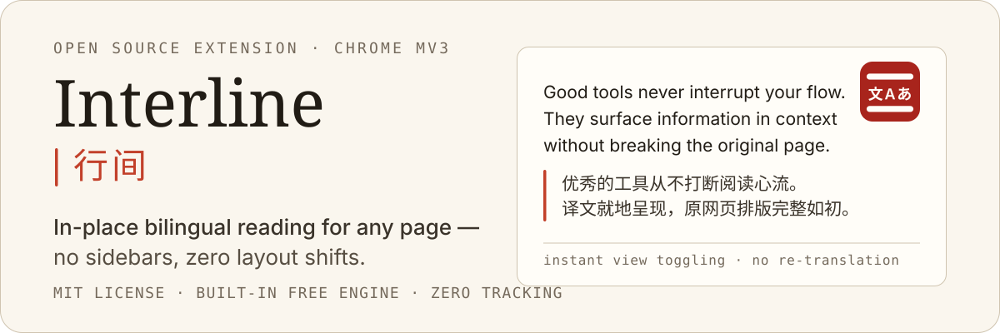
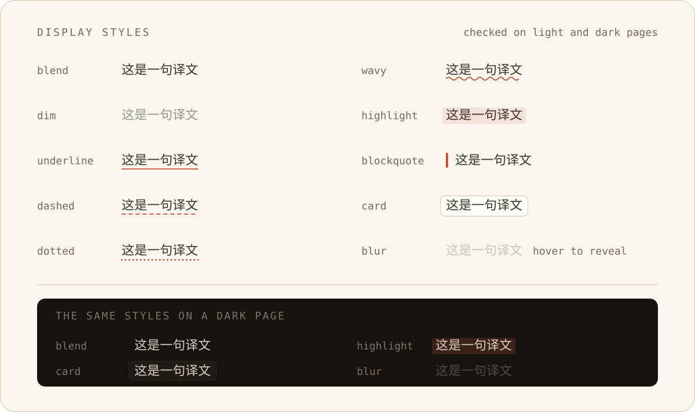

<p align="right">
  <strong>English</strong> · <a href="./README.zh-CN.md">简体中文</a> · <a href="./README.ja.md">日本語</a> · <a href="./README.ko.md">한국어</a>
</p>

<p align="center">
  
</p>

<p align="center">
  <a href="./LICENSE"></a>
  
  
  
  
  
  
</p>

**Interline** is an open-source bilingual reading extension for Chrome. It inserts translations directly beneath original paragraphs in place — keeping layout, formatting, links, and interactions completely intact without replacing the page or pulling you into a sidebar.

- **Ready out of the box** — Includes a built-in free translation engine that works immediately on install with zero configuration.
- **Bring your own key (BYOK)** — Connect OpenAI, Anthropic, Google Gemini, OpenRouter, or any OpenAI-/Anthropic-compatible endpoint (Ollama, Kimi, GLM, LiteLLM…) for higher quality.
- **Privacy-first** — Zero user accounts, zero telemetry, zero trackers, and zero intermediary proxy servers. Requests go directly from your browser to the configured provider.

---

## Whole-Page Bilingual Reading

Translations are injected as **sibling nodes** of the original text. Links, `<strong>`, inline code spans, and list structures remain intact. Ten display styles let you choose how translations appear alongside the original content:

<p align="center">
  
</p>

- **Three view modes** — Switch instantly between Bilingual (default), Translation-only, and Original-only. Mode switching is handled purely via CSS transitions over already injected text, requiring no re-translation.
- **Paragraph pairing** — Keeps each paragraph paired with its translation rather than stacking two disjointed text blocks.
- **Custom typography** — Set translations in clean brush/serif fonts (e.g. LXGW WenKai, Kaiti) or let them inherit the host page's typeface.

## Selection Translation

Select any text on the page to reveal a floating action button. Clicking it streams the translation into a popup card, with a subtle shimmer placeholder until the first token arrives.

When connected to an LLM provider, the card can expand **word notes** to provide contextual explanations for idioms, technical terms, and proper nouns.

## In-Input Quick Translation

Press <kbd>Space</kbd> three times in any input field to translate draft text in place. Prefix your text with `/en` or `en:` to temporarily switch target languages on the fly.

Supports native `<input>` / `<textarea>` elements, `contenteditable` areas, and modern editors (CKEditor, Slate, TipTap, Monaco, CodeMirror, wangEditor). Every write operation performs a read-back verification to fail safely without corrupting drafts. Restoring original text is supported via <kbd>⌘/Ctrl</kbd> + <kbd>Z</kbd> within the undo window.

## Floating Action Button & Quick Controls

A draggable floating button docks to the window edge without obstructing page content. Click once to translate the whole page, or expand the control panel to adjust target language, view mode, display style, and per-site rules in real time.

---

## Install

Requires Chrome 116+ (or any Chromium-based browser at or above that version). A Firefox target is included in source.

### Build from source

```bash
pnpm install
pnpm build          # Output generated in .output/chrome-mv3/
```

1. Open `chrome://extensions` in Chrome.
2. Enable **Developer mode** in the top right corner.
3. Click **Load unpacked** and select the `.output/chrome-mv3/` directory.

**First run:** Click the toolbar icon to open Settings. The built-in free engine is ready immediately; configure custom API keys under **AI Engines** whenever needed.

## Privacy & Security

- **Direct requests only** — Text is sent solely to the engine you configure. The project does not collect metrics, telemetry, or user analytics, and operates no central backend server.
- **Local credential storage** — API keys are stored exclusively in local extension storage (`chrome.storage.local`). Keys are never logged and leave your browser only inside the `Authorization` header sent to your chosen endpoint.
- **HTTPS enforcement** — Custom endpoints enforce HTTPS by default (loopback addresses `127.0.0.1` / `localhost` and `.local` hosts excluded) to prevent API key exposure over plain text connections.
- **Minimal permissions** — Requests only `storage`, `contextMenus`, and `alarms`. Broad permissions like `tabs` and `scripting` are not requested.

---

## Customization & Power Features

- **Prompt Styles** — Select preconfigured tones (academic, plain, literary, etc.) or write custom instructions. Includes a live preview rendered via the actual prompt builder, with domain-level binding support.
- **Glossaries** — Pin preferred translations for technical terms and jargon with glob-based domain matching. Supports CSV, TSV, and JSON import/export alongside built-in presets.
- **Site Rules** — Configure domain-level execution policies (`Always`, `Manual`, `Never`) with wildcard support.
- **12 Interface Languages** — Full localization for `zh`, `zh-TW`, `en`, `ja`, `ko`, `fr`, `de`, `es`, `ru`, `pt`, `it`, and `ar` (with complete RTL support). The UI language automatically follows the translation target language by default.

## Automatic Model Adaptation

The extension exposes only the three settings that matter for translation: **Temperature**, **Max Output Tokens**, and **Reasoning / Thinking**. Protocol quirks across model families are adapted automatically:

| Model Family | Automatic Adaptation |
| --- | --- |
| OpenAI `o1` / `o3` / `o4` | Strips custom temperature (rejected by endpoint) and maps disabled reasoning to the lowest supported effort level |
| Claude 3.7 / 4.x / 5.x | Automatically sends `thinking` with budget, ensuring `max_tokens` exceeds the reasoning budget |
| Claude 3.0 / 3.5 | Omits `thinking` parameters to avoid endpoint errors on older model versions |
| Gemini 2.x / 3.x | Maps parameters to `thinkingLevel` per Gemini protocol specifications |
| Reasoning-native (`r1`, `qwq`, `:thinking`) | Avoids sending explicit disable flags that cause gateways like OpenRouter to return HTTP 400 |

If an endpoint rejects a parameter, the request automatically strips the offending field and retries once in place to ensure graceful degradation.

---

## Development

```bash
pnpm dev                 # Chrome development with HMR
pnpm dev:firefox         # Firefox development

pnpm compile             # TypeScript type check (tsc --noEmit)
pnpm lint                # ESLint check
pnpm test                # Vitest test suite (happy-dom + fake-browser)
pnpm i18n                # Compile messages/*.json → src/paraglide

pnpm build && pnpm zip   # Build and package .output/*.zip for Chrome Web Store
```

`pnpm dev` also serves `test-pages/` — a suite of hostile host pages used to verify boundary isolation (62.5% rem root, unprefixed Tailwind v3, shadow hosts, virtualized editors).

### Quality Gates

CI enforces three automated audits:

```bash
pnpm audit:css       # Verifies all root-level CSS variables are strictly scoped to .aie-omt-surface-root
pnpm audit:ascii     # Ensures build chunks contain only ASCII characters (avoids Chrome non-ASCII loading bug — wxt#353)
pnpm audit:bundle    # Content script gzip budgets: page-translate ≤ 100 KB, float-ui ≤ 260 KB
```

## Architecture

This project is built on top of [aie-wxt-mantine-surface-template](https://github.com/AIEPhoenix/aie-wxt-mantine-surface-template), which establishes the foundational multi-surface architecture combining WXT, React 19, Mantine 9, and Shadow Root DOM isolation. For in-depth design rationale, satellite surface lifecycles, and styling isolation patterns, refer to the template repository.

```text
src/
├── entrypoints/           # WXT entry points (thin mount layers)
│   ├── background.ts      # Engines, streaming server, config gateway, menus, cache management
│   ├── options/           # Full-page settings interface
│   ├── page-translate.content/   # Whole-page translation state owner
│   ├── float-ui.content/         # Floating button + selection card (shared shadow surface)
│   ├── editor-injector.content/  # MAIN-world editor bridge
│   └── injector-port.content.ts  # Isolated ⇄ main world port handshake
├── react-app/             # UI: apps, components, hooks, VisualManager
├── services/              # Translation engines, prompt builder, glossary, cache, config, streaming
├── dom/                   # Traversal, insertion, wrappers, in-page input translation
├── surface/               # Shadow surface abstraction (document + satellite)
└── data/models/           # Configuration schemas and shared types
```

### Core Engineering Invariants

1. **Host Page Inviolability** — All extension UI elements are isolated inside Shadow Roots. Inserted translations are purely additive and fully reversible; clearing translations restores the host DOM byte-for-byte. CSS boundaries are verified by `pnpm audit:css`.
2. **Engine & Page Decoupling** — Content scripts communicate with the background service worker exclusively through typed message ports. API keys and AI SDK dependencies exist only in the service worker, keeping injected script footprints within strict budgets.
3. **Unified Prompt Pipeline** — Single, streaming, and batch translation pipelines share the exact same preflight checks, cache key generation, and prompt builder logic to prevent behavioral drift across surfaces.

`PROJECT_PREFIX` (`prefix.cjs`) serves as the single source of truth for generated class names, custom elements, storage keys, and CSS variables. The `check-prefix-sync` Vite plugin verifies synchronization at build time.

## Contributing

Issues and pull requests are welcome. Before submitting a pull request, ensure all checks pass:

```bash
pnpm compile && pnpm lint && pnpm test && pnpm build && pnpm audit:css && pnpm audit:ascii && pnpm audit:bundle
```

UI copy is maintained in `messages/*.json`. After modifying copy, run `pnpm i18n` and include the generated `src/paraglide/` updates in your commit.

## License

[MIT](./LICENSE)

Fonts are referenced via standard CSS font stacks and are not bundled in build artifacts: LXGW WenKai, Hanken Grotesk, Spline Sans Mono, and EB Garamond are licensed under SIL OFL 1.1, falling back to local system fonts when absent.
