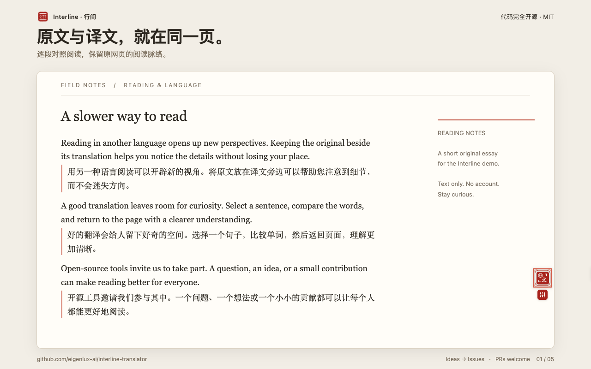

<p align="right">
  <a href="./README.md">English</a> · <strong>简体中文</strong> · <a href="./README.ja.md">日本語</a> · <a href="./README.ko.md">한국어</a>
</p>

# Interline · 行间

**读懂世界，留在原文里。**

Interline（行间）是一款代码完全开源的 Chrome 双语阅读与翻译扩展。读文章时逐段对照原文与译文，遇到不懂的句子随手划词，参与讨论时就在输入框里翻译草稿。

**[完整源代码](https://github.com/eigenlux-ai/interline-translator) · [提出功能需求](https://github.com/eigenlux-ai/interline-translator/issues/new?template=feature_request.yml) · [反馈问题](https://github.com/eigenlux-ai/interline-translator/issues/new?template=bug_report.yml) · [参与贡献](./CONTRIBUTING.md)**

**[从 Chrome 应用商店安装](https://chromewebstore.google.com/detail/mcefogikngeheopmdmaapfgpnnlgcoid)**

[MIT 许可](./LICENSE) · Chrome 116+ · 内置免 Key 翻译 · 支持自备 AI 密钥



## 阅读、理解，再表达

| 你想做什么 | 行间如何帮助你 |
| --- | --- |
| 阅读外语网页 | 通过悬浮控件、右键菜单或 **Alt+T** 开始翻译，原文和译文留在同一页。 |
| 理解一句话 | 选中文本，点击翻译图标，查看、复制或朗读译文。支持的 AI 引擎还能提供词汇释义。 |
| 用另一种语言回复 | 写好草稿后，连按 **三次空格** 原地翻译。写作目标语言与阅读目标语言可以分别设置。 |
| 调整阅读体验 | 切换双语、仅译文或仅原文视图，选择 10 种译文样式，以及浅色或深色外观。 |
| 统一语气和专业术语 | 使用 AI 引擎时，自定义翻译风格、提示词和术语表，并按站点应用。 |

查看实际的[划词卡片](./assets/store/zh_CN/screenshot-2-selection.png)、[引擎设置](./assets/store/zh_CN/screenshot-3-settings.png)、[输入框翻译](./assets/store/zh_CN/screenshot-4-input-translation.png)和[深色设置](./assets/store/zh_CN/screenshot-5-dark-mode.png)。截图使用原创示例内容和真实插件界面，外围标题是功能说明。

## 开始使用

**[从 Chrome 应用商店安装](https://chromewebstore.google.com/detail/mcefogikngeheopmdmaapfgpnnlgcoid)**

打开商店页面，点击**添加至 Chrome**。安装后打开一篇文章，通过悬浮翻译控件或 **Alt+T** 开始翻译；点击工具栏中的行间图标，设置阅读目标语言和翻译引擎。

### 从源码构建

准备 Git、Node.js 22+ 和 pnpm 10.7.1（与 `package.json` 固定版本一致）。

```sh
git clone https://github.com/eigenlux-ai/interline-translator.git
cd interline-translator
pnpm install --frozen-lockfile
pnpm build
```

1. 在 Chrome 中打开 `chrome://extensions`，启用**开发者模式**。
2. 点击**加载已解压的扩展程序**，选择仓库里的 `.output/chrome-mv3/` 目录。
3. 打开一篇文章，通过悬浮翻译控件或 **Alt+T** 开始翻译。
4. 点击浏览器工具栏中的行间图标打开设置，选择阅读目标语言；需要时再添加 AI 引擎。

内置 Google Translate 引擎无需 API Key，但它是在线翻译服务，可用性取决于网络和服务商。

`chrome://` 等浏览器限制页面无法使用网页内翻译。网站排版和编辑器实现各不相同，不能保证兼容所有页面。仓库提供 Firefox 开发与构建命令；这里的截图来自 Chromium 环境。

## 选择适合你的翻译引擎

可以直接使用内置免费引擎，也可以自备 API Key 接入 **OpenAI、Anthropic、Google Gemini、OpenRouter**，或兼容 OpenAI / Anthropic 协议的服务。正确配置后，也可连接 Ollama 等本地服务。

行间的代码以 MIT 许可免费开放。第三方 AI 服务可能收取 API 使用费用，并有各自的配额和可用范围。AI 引擎可使用提示词风格、术语表指令和上下文释义；翻译质量取决于模型、文本与配置。

输入框翻译支持在草稿开头加 `/en` 或 `en:`，为这一次指定译入英语。翻译后会短暂显示撤销入口，可还原原文。支持原生输入框、文本域、可编辑内容及多种富文本 / 代码编辑器适配，具体表现取决于网站使用的编辑器。

## 按你的习惯阅读

- **显示方式：** 三种视图、10 种译文样式，可选择译文字体。对已翻译的页面切换视图不会重新请求翻译。
- **站点规则：** 指定哪些网站自动翻译、哪些不翻译，支持通配符匹配。
- **界面语言：** 提供 12 种语言，包含阿拉伯语 RTL 布局。默认跟随阅读目标语言，也可单独指定。
- **配置备份：** 支持导出和导入设置。**导出的 JSON 包含 API Key**，请妥善保管。

## 数据会去哪里

行间无需注册账号，没有行为分析埋点或遥测，也不运营翻译中转服务器。翻译请求由浏览器直接发送到你选择的服务商；使用内置引擎时，接收方是 Google。

请求包含需要翻译的文本；AI 功能还会按需使用页面标题、相邻文本、匹配的术语表条目等上下文。开启**通读全文**后，会额外发送页面前 8,000 个字符，包括尚未滚动到的部分。配置自动翻译规则后，匹配的页面可能无需再次点击就发起翻译。

设置与 API Key 保存在本地浏览器，调用服务时按其认证方式发送所需凭据。译文会在本地缓存。服务商有各自的数据政策；有关权限、缓存期限和备份的细节，请阅读[隐私说明](./PRIVACY.md)。

## 完全开源，欢迎一起改进

全部源代码以 [MIT 许可](./LICENSE)公开。你可以查看实现、自行构建、修改，也可以把改进贡献回来。

- **有新的功能需求？** 欢迎[提交 Issue](https://github.com/eigenlux-ai/interline-translator/issues/new?template=feature_request.yml)，说说你的使用场景和想解决的问题。
- **发现 Bug？** 请[反馈问题](https://github.com/eigenlux-ai/interline-translator/issues/new?template=bug_report.yml)，附上复现步骤和浏览器版本。
- **想参与开发？** 代码、修复、翻译、文档和可复现的示例都欢迎。**PRs welcome！** 查看[贡献指南](./CONTRIBUTING.md)和 [Pull Requests](https://github.com/eigenlux-ai/interline-translator/pulls)。

公开反馈中请勿附带 API Key、私密网页内容或配置备份文件。

## 本地开发

```sh
pnpm dev          # Chrome 开发环境与热更新
pnpm compile      # TypeScript 检查
pnpm lint         # ESLint
pnpm test         # 测试
pnpm build        # Chrome 生产构建
pnpm zip          # 扩展打包
```

架构、测试页面、多语言维护与构建审计见[贡献指南](./CONTRIBUTING.md)。商店文案、真实截图及重新生成方式见[商店素材说明](./assets/store/README.md)。

项目使用 WXT、React、Mantine 和 TypeScript，基于 [aie-wxt-mantine-surface-template](https://github.com/AIEPhoenix/aie-wxt-mantine-surface-template) 构建。
