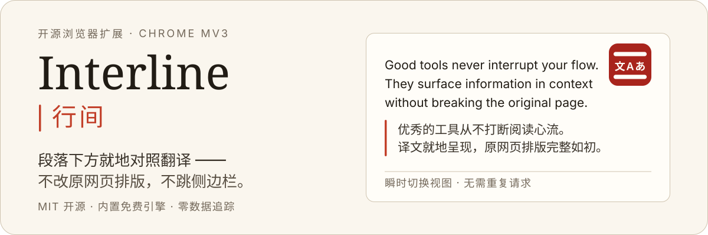
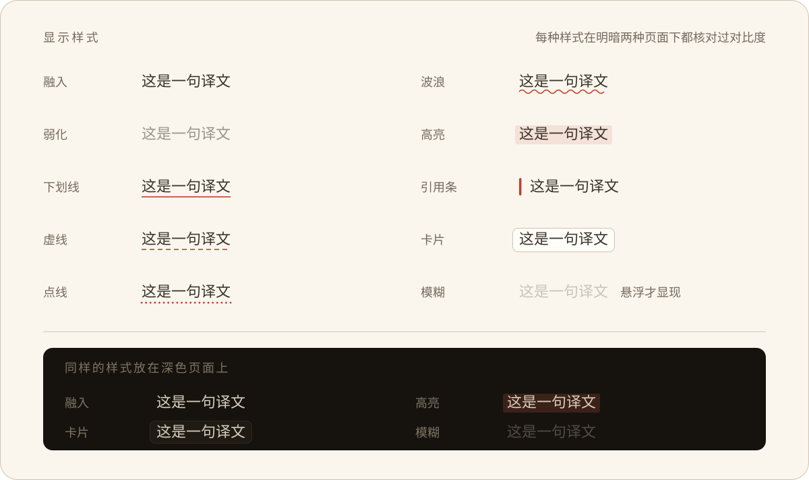

<p align="right">
  <a href="./README.md">English</a> · <strong>简体中文</strong> · <a href="./README.ja.md">日本語</a> · <a href="./README.ko.md">한국어</a>
</p>

<p align="center">
  
</p>

<p align="center">
  <a href="./LICENSE"></a>
  
  
  
  
  
  
</p>

**Interline（行间）** 是专为 Chrome 设计的开源双语阅读扩展。译文直接插入对应段落下方就地对照，无需跳转侧边栏或替换原网页，原网页排版、链接与交互完整保留。

- **开箱即用** —— 内置免 Key 免费翻译引擎，安装后无需任何配置即可直接翻译。
- **自带密钥（BYOK）** —— 支持接入 OpenAI、Anthropic、Google Gemini、OpenRouter，以及各类兼容 OpenAI / Anthropic 协议的本地与第三方端点（Ollama、Kimi、GLM、LiteLLM 等）获取更高翻译质量。
- **隐私优先** —— 零注册账号、零行为埋点与遥测，无自建中转服务器，请求直连目标服务商。

---

## 整页双语对照阅读

译文作为**兄弟节点**注入 DOM，网页原有的超链接、粗体、行内代码及列表层级均完整保留。提供 10 种显示样式，自由搭配阅读偏好：

<p align="center">
  
</p>

- **三种视图模式** —— 支持双语对照（默认）、仅看译文、仅看原文。视图切换基于纯 CSS 实现，瞬时生效且不重复消耗 Token。
- **段落级对齐** —— 原文与译文逐段紧邻排版，避免传统翻译工具上下脱节的双块堆叠。
- **字体定制** —— 译文支持独立选用楷体（如霞鹜文楷、Kaiti）或直接继承宿主网页字体。

## 划词翻译

选中文本后点击浮现的翻译图标，译文即以流式卡片呈现；网络响应期间展示骨架屏占位，消除空白等待感。

连接大模型引擎时，卡片支持展开**词汇释义**，针对成语、技术术语和专有名词提供上下文说明。

## 输入框原地翻译

在任意输入框中连按三次 <kbd>Space</kbd>，草稿即原地转换为目标语言。在文本开头添加 `/en` 或 `en:` 可临时指定单次翻译的目标语种。

全面支持原生 `<input>` / `<textarea>`、`contenteditable` 区域，以及富文本与代码编辑器（CKEditor、Slate、TipTap、Monaco、CodeMirror、wangEditor）。每次写入均执行回读校验，写入失败时安全回滚，避免损坏草稿内容；撤销窗口内支持使用 <kbd>⌘/Ctrl</kbd> + <kbd>Z</kbd> 快捷还原原文。

## 悬浮控制面板

轻量悬浮球支持自由拖拽并自动贴边停靠，不遮挡阅读内容。点击即可触发整页翻译；展开控制面板可实时调整目标语言、视图模式、显示样式与当前站点规则，配置即时生效。

---

## 安装指南

运行环境：Chrome 116 及以上版本（或其他基于 Chromium 内核的同版本浏览器）。代码库内置 Firefox 构建目标。

### 从源码构建

```bash
pnpm install
pnpm build          # 构建产物位于 .output/chrome-mv3/
```

1. 在 Chrome 中打开 `chrome://extensions`。
2. 开启右上角「开发者模式」。
3. 点击「加载已解压的扩展程序」，选择 `.output/chrome-mv3/` 目录。

**首次使用：** 点击浏览器工具栏图标打开设置。内置免 Key 引擎已就绪；如需更高翻译质量，可在「AI 引擎」中配置自定义 API Key。

## 隐私与安全

- **直连请求** —— 文本仅发送至用户配置的翻译引擎，无任何第三方收集，不包含遥测或行为分析代码，本项目不运营任何中心化服务。
- **本地凭据存储** —— API Key 仅保存在本地浏览器存储（`chrome.storage.local`），不记录运行日志，仅在发起翻译请求时作为 `Authorization` 请求头传递给指定端点。
- **HTTPS 强制** —— 自定义接口强制要求 HTTPS 协议（回环地址 `127.0.0.1` / `localhost` 与 `.local` 局域网主机除外），防止 API Key 在明文网络中泄露。
- **最小权限原则** —— 仅申请 `storage`、`contextMenus` 与 `alarms` 权限，不申请 `tabs` 与 `scripting` 广谱权限。

---

## 个性化配置

- **提示词风格（Prompt Style）** —— 支持选用学术严谨、通俗易懂、文学润色等预设语气，或编写自定义 Prompt；提供真实构建器支持实时效果预览，并支持将特定风格绑定到指定域名。
- **术语表管理（Glossary）** —— 自定义专业术语对照映射，确保关键名词翻译准确一致；支持通配符限定生效域名，提供 CSV、TSV、JSON 导入导出及内置常用预设。
- **站点规则** —— 按域名配置「总是翻译」、「手动翻译」或「从不翻译」，支持通配符匹配。
- **12 种界面语言** —— 提供 12 种界面语言（`zh`、`zh-TW`、`en`、`ja`、`ko`、`fr`、`de`、`es`、`ru`、`pt`、`it`、`ar`，完整支持 RTL 布局）。界面语言默认跟随目标翻译语言自适应切换。

## 智能模型参数适配

核心参数仅保留**温度（Temperature）**、**最大输出 Token** 与**推理思考（Reasoning / Thinking）**，扩展针对不同模型族的协议差异提供自动兼容与降级策略：

| 模型族 | 自动处理逻辑 |
| --- | --- |
| OpenAI `o1` / `o3` / `o4` | 自动移除自定义温度参数（端点不支持），关闭推理时映射为端点允许的最低推理级别 |
| Claude 3.7 / 4.x / 5.x | 自动传递带预算的 `thinking` 参数，并确保 `max_tokens` 高于思考预算 |
| Claude 3.0 / 3.5 | 自动剔除 `thinking` 字段，避免早期模型接口报错 |
| Gemini 2.x / 3.x | 自动映射为 `thinkingLevel` 参数适配官方协议 |
| 原生推理模型（`r1`、`qwq`、`:thinking` 等） | 避免下发禁用推理标志，防止 OpenRouter 等网关返回 HTTP 400 |

若端点仍拒绝特定参数，请求会自动剔除异常字段并原地重试一次，确保接入未知新模型时优雅降级而非直接报错。

---

## 本地开发

```bash
pnpm dev                 # Chrome 开发环境，支持 HMR
pnpm dev:firefox         # Firefox 开发环境

pnpm compile             # TypeScript 类型检查（tsc --noEmit）
pnpm lint                # ESLint 代码检查
pnpm test                # Vitest 测试套件（happy-dom + fake-browser）
pnpm i18n                # 编译文案 messages/*.json → src/paraglide

pnpm build && pnpm zip   # 构建并打包 .output/*.zip 供发布使用
```

`pnpm dev` 同时提供 `test-pages/` 测试页面 —— 包含一系列刻意设计的极端宿主环境（62.5% rem 根字号、无前缀 Tailwind v3、Shadow Root 宿主、虚拟滚动编辑器），用于严格验证隔离性。

### 质量门禁

CI 自动化执行三项独立审计：

```bash
pnpm audit:css       # 校验所有根级 CSS 变量均严格封装在 .aie-omt-surface-root 命名空间内
pnpm audit:ascii     # 确保构建产物为纯 ASCII 字符（规避 Chrome 针对非 ASCII Chunk 的加载缺陷 —— wxt#353）
pnpm audit:bundle    # 内容脚本体积预算约束：page-translate ≤ 100 KB，float-ui ≤ 260 KB（Gzip）
```

## 核心架构设计

本项目基于 [aie-wxt-mantine-surface-template](https://github.com/AIEPhoenix/aie-wxt-mantine-surface-template) 模板脚手架开发。该模板定义了现代浏览器扩展中基于 WXT、React 19、Mantine 9 与 Shadow Root 跨表面隔离的基础架构规范。更深入的脚手架设计背景、多表面通信与样式隔离细节可参考该模板仓库。

```text
src/
├── entrypoints/           # WXT 入口层（轻量挂载）
│   ├── background.ts      # 翻译引擎、流式服务端、配置网关、右键菜单、缓存清理
│   ├── options/           # 全屏设置页
│   ├── page-translate.content/   # 整页翻译状态管理
│   ├── float-ui.content/         # 悬浮球 + 划词卡片（共用 Shadow Surface）
│   ├── editor-injector.content/  # 主世界（MAIN world）编辑器通信桥
│   └── injector-port.content.ts  # 隔离世界 ⇄ 主世界端口握手
├── react-app/             # UI 体系：应用、组件、Hooks、VisualManager
├── services/              # 翻译引擎、提示词构建、术语表、缓存、配置、流式调度
├── dom/                   # DOM 遍历、节点插入、包装器、输入框原地翻译
├── surface/               # Shadow Surface 抽象（Document + Satellite）
└── data/models/           # 配置 Schema 与核心数据类型
```

### 三项工程原则

1. **宿主页面不可侵犯**：所有扩展 UI 均隔离在 Shadow Root 内部；注入的译文为增量插入且支持完整逆向清理；关闭翻译后 DOM 结构与原网页保持字节级一致。CSS 隔离边界通过 `pnpm audit:css` 门禁自动化校验。
2. **引擎逻辑与页面完全解耦**：内容脚本（Content Scripts）仅通过强类型消息通道与 Background Service Worker 通信；API Key、AI SDK 及网络请求逻辑全部收敛于 Service Worker，使注入页面的脚本体积保持在极致预算内。
3. **统一提示词与多流水线复用**：单次翻译、流式翻译与批量翻译共享同一套 Preflight 校验、缓存键生成与 Prompt 构建逻辑，杜绝各交互表面的行为漂移。

`PROJECT_PREFIX`（`prefix.cjs`）为所有类名、自定义元素、存储键和 CSS 变量的唯一命名空间源头。`check-prefix-sync` Vite 插件在构建阶段执行同步校验。

## 参与贡献

欢迎提交 Issue 和 Pull Request。在发起 PR 前，请确保通过全套质量检查：

```bash
pnpm compile && pnpm lint && pnpm test && pnpm build && pnpm audit:css && pnpm audit:ascii && pnpm audit:bundle
```

界面文案集中维护于 `messages/*.json`。修改文案后请执行 `pnpm i18n`，并将重新生成的 `src/paraglide/` 目录一同提交。

## 软件许可

[MIT](./LICENSE)

字体通过系统标准 CSS 字体栈声明引用，不打包进扩展分发产物：霞鹜文楷、Hanken Grotesk、Spline Sans Mono、EB Garamond 均遵循 SIL OFL 1.1 许可，系统未安装时自动平滑回退至本机系统字体。
